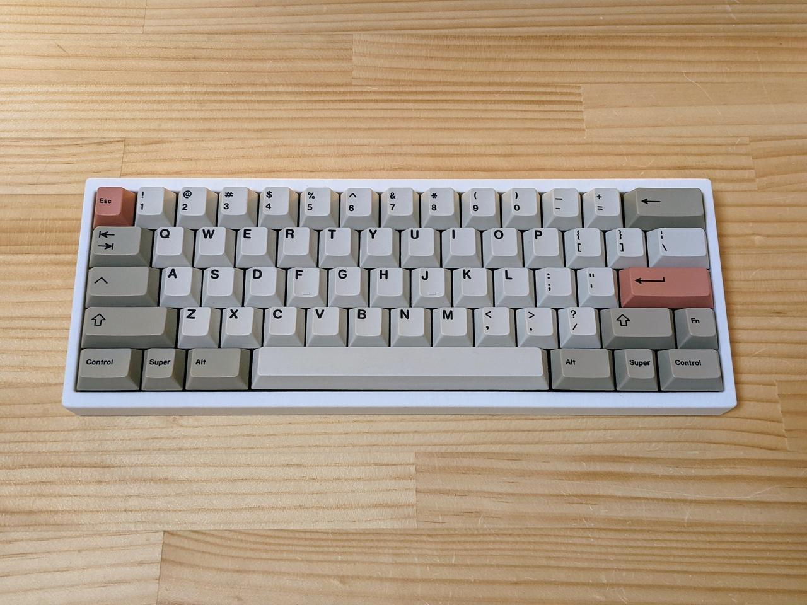
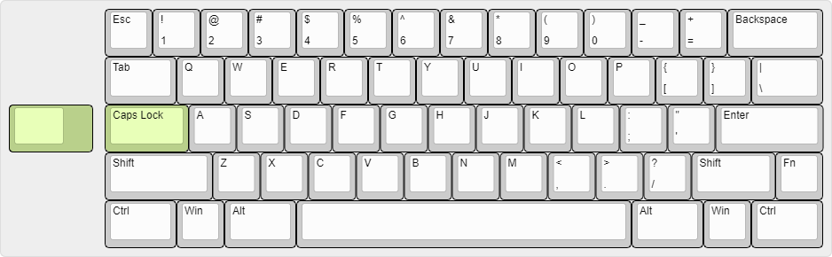

# Bakeneko 60 V3

A simple 60% keyboard for DIYers. This project is a special homage to TGR x Singa UNIKORN 60 and OTD 356 Mini. See also the [introduction video](https://youtu.be/8zyG34YU3BY).

## Features

- Single piece tray case
- O-ring gasket mount (Friction fit)
- [Unified Daughterboard](https://github.com/ai03-2725/Unified-Daughterboard)
- QMK firmware and VIA
- Compatible with common 60% plates
- PCB designed with KiCAD 5.1.4

## Layouts

## Specs

- Dimensions: 295 x 110 x 30mm
- Front height: 18.5mm
- Home row height: 31mm(with GMK keycaps and bumpons)
- Typing angle: 6 degree
- Weight:
  - PLA Case: 370g
  - Aluminum Case: 700g
- O-ring gasket: VMQ-50(Silicone 50 duro) AS568-262

## Notes

- Old files (v1) are no longer available. See [geekhack post](https://geekhack.org/index.php?topic=107316.msg2974824#msg2974824) for the context
- The use of old (v1) mounting posts is prohibited
- All files are to be used at your own risk
- As for stabilizers, only PCB snap ins are supported
- This open source version is not compatible with CannonKeys Bakeneko

## Resources

- Documents: https://drive.google.com/drive/folders/1tddSihOS8Pgf1lTQOjHohYCl8efxXIeH
  - Parts guide and other useful information
  - Will be added and updated as needed
- Discord: https://discord.gg/fMY96TeEwV
  - Have fun with community members
  - Talk about Bakeneko builds and mods, and share your works
  - You can also contact me from there

## Special thanks to

- **Elaine** for [Unikorn](https://geekhack.org/index.php?topic=98587.50). Allowed me to publish the Unikorn-inspired case as open source and encouraged me
- Of course, I also show my respect and gratitude to **yuktsi**
- **coarse** for PCB review and kind support. His great work has refined the PCB well

## Also I should mention

- **OTD** for 356 Mini. Origin of O-ring gasket mount style
- **Evy** for [Plain60 series](https://github.com/evyd13/plain60-c). I used it as a reference for my PCB design. They also answered my miscellaneous questions
- **ai03** for [MX_Alps_Hybrid](https://github.com/ai03-2725/MX_Alps_Hybrid). Also got a lot of help from his discord server
- **overset** for [JP01](https://github.com/overset/JP01). The idea of publishing the case design on Onshape. After seeing their great work I switched from fusion360 to Onshape
- **Rhuk** gave me a lot of advice on keyboard design and manufacturing
- **Maker Keyboards** suggested adding a plate cutout to remove the PCB using a keycap puller
- And many community members for giving me advice and feedback, thanks!
