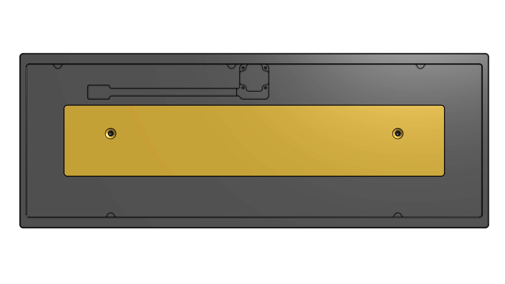

# Bakeneko 60 V3

**V3 is still a work in progress.**
 - Previous versions are available for download on [the release page](https://github.com/kkatano/bakeneko-60/releases)
 - Don't use the files for manufacturing

A simple 60% keyboard for DIYers. This project is a special homage to TGR x Singa UNIKORN 60 and OTD 356 Mini.

## Features

- Seamless tray case
- O-ring gasket mount
- USB-C with [Unified Daughterboard](https://github.com/ai03-2725/Unified-Daughterboard)
- QMK firmware and VIA ready
- Compatible with common 60% plates

## Layouts

## Specs

- Dimensions: 295 x 110 x 30mm
- Front height: 18.6mm
- Home row height: 31mm(with GMK keycaps and bumpons)
- Typing angle: 6 degree
- Weight:
  - PLA Case: 500g including stainless weight
  - Aluminum Case: 1,000g including brass weight
- O-ring gasket: VMQ-50(Silicone 50 duro) AS568-262

## Mounting Style

TBU

## Typing Sounds

TBU

## Showcase 

TBU

## Assets

### PCB
- [bakeneko-60/pcb](./pcb)

### Firmware
- [https://github.com/qmk/qmk_firmware/tree/master/keyboards/bakeneko60](https://github.com/qmk/qmk_firmware/tree/master/keyboards/bakeneko60)

### Case
- [bakeneko-60/case](./case)

### Plate
- [bakeneko-60/plate](./plate)

## Contact

- Discord: https://discord.gg/fMY96TeEwV

## Special thanks to

- **Elaine** for [Unikorn](https://geekhack.org/index.php?topic=98587.50). Allowed me to publish the Unikorn-inspired case as open source and encouraged me
- Of course, I also show my respect and gratitude to **yuktsi**
- **coarse** for PCB review and kind support. His great work has refined the PCB well

## Also I should mention

- **OTD** for 356 Mini. Origin of O-ring gasket mount style
- **Evy** for [Plain60 series](https://github.com/evyd13/plain60-c). I used it as a reference for my PCB design. They also answered my miscellaneous questions
- **ai03** for [MX_Alps_Hybrid](https://github.com/ai03-2725/MX_Alps_Hybrid) and [random-keyboard-parts.pretty](https://github.com/ai03-2725/random-keyboard-parts.pretty). Also got a lot of help from his discord server
- **overset** for [JP01](https://github.com/overset/JP01). The idea of publishing the case design on Onshape. After seeing their great work I switched from fusion360 to Onshape
- And many community members for giving me advice and feedback, thanks!
