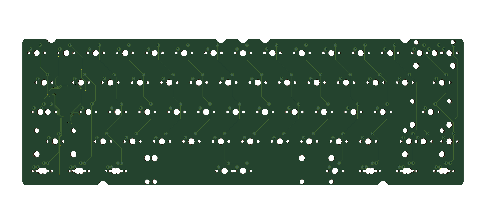
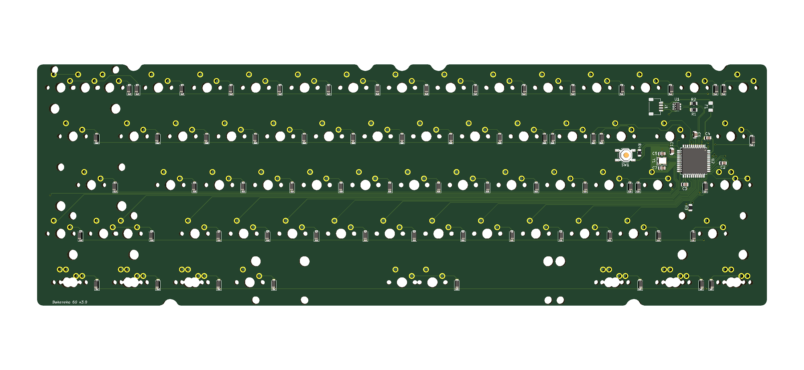

# Bakeneko 60 PCB

A simple PCB for Bakeneko 60

## Features
 * Supports Cherry MX and clone switches
 * QMK Firmware and VIA ready
 * No switch LEDs and no underglow
 * All switches are south facing
 * JST SH Connector for [Unified Daughterboard](https://github.com/ai03-2725/Unified-Daughterboard)
 * ESD protection
 * Designed with KiCAD 5.1.4
